# Every flow (PR 16 test plan, part 1)

Each flow: the diagram (mermaid source and the rendered PNG in [`flows/`](flows/)), who may run it and who **must not** be
able to, the warnings it touches (codes from [`coverage.md`](coverage.md) §2), and what is automated today (flow files
under `e2e/`, test codes from `docs/testing-strategy.md`).

Roles used throughout: **CR** creator (seated or non-playing) · **AD** game admin (seated, or non-playing co-admin) ·
**PL** registered player seated in the game · **UP** unregistered placeholder (no device; managed by an organiser) ·
**SP** spectator / view-only · **OU** outsider (signed in, not in the game) · **SO** signed out (web `/r/` link only) ·
**AA** app admin (`profiles.role = app_admin`).

Index: F01 Sign in · F02 Claim / link · F03 Home · F04 New game Players · F05 New game Game type · F06 Scorecard ·
F07 Add round (Points) · F08 Add round (Pool) · F09 Undo / edit round · F10 Players / Admins · F11 Game log ·
F12 Complete (Points) → Final scores → share · F13 Complete (Pool) → Awards → Results · F14 Results · F15 My players ·
F16 Me / Profile / Settings · F17 Help · F18 Delete / reopen / hidden · F19 Public web pages.

---

### F01 — Sign in, register, forgot passcode, sign out

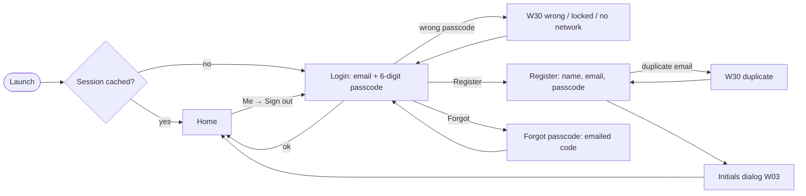
```mermaid
flowchart LR
  A([Launch]) --> B{Session cached?}
  B -- yes --> H[Home]
  B -- no --> L[Login: email + 6-digit passcode]
  L -- wrong passcode --> L1[W30 wrong / locked / no network] --> L
  L -- Register --> R[Register: name, email, passcode]
  R -- duplicate email --> R1[W30 duplicate] --> R
  R --> I[Initials dialog W03] --> H
  L -- Forgot --> F[Forgot passcode: emailed code] --> L
  L -- ok --> H
  H -- Me → Sign out --> L
```

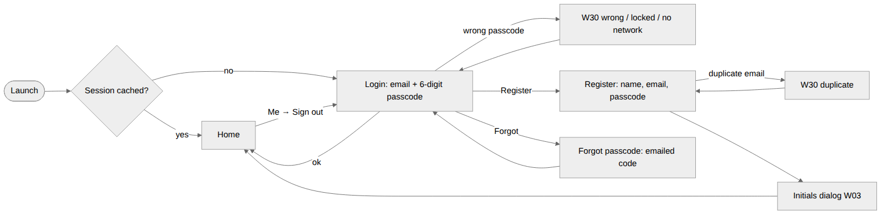

| Who | May | Must not |
| --- | --- | --- |
| anyone | sign in, register, request a code | see another user's games after a wrong passcode; skip the passcode by killing the app mid-login |
| SO | reach Login only | open any `(screens)` route by deep link without a session (redirect to Login) |

Warnings: W30, W03. Automated: `smoke/01` (sign in), `full/10` (bad passcode, sign out), U (`lib/sign-in`), D (021 reset).

### F02 — Claim / link a player ID

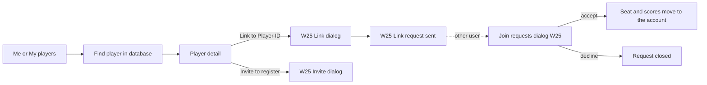
```mermaid
flowchart LR
  A[Me or My players] --> B[Find player in database]
  B --> C[Player detail]
  C -- Link to Player ID --> D[W25 Link dialog]
  D --> E[W25 Link request sent]
  E -. other user .-> F[Join requests dialog W25]
  F -- accept --> G[Seat and scores move to the account]
  F -- decline --> H[Request closed]
  C -- Invite to register --> I[W25 Invite dialog]
```

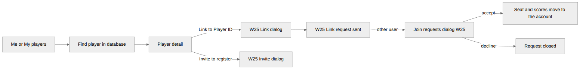

| Who | May | Must not |
| --- | --- | --- |
| CR / AD | send a link request for a placeholder they manage; invite | link a placeholder someone else manages; link to a user who already holds a seat in that game |
| PL | accept / decline requests addressed to them | accept a request addressed to another user |
| OU | nothing in a game they are not in | see the placeholder's scores before accepting |

Warnings: W25, W29 (20 pending requests guardrail). Automated: U, D (017, 025). No device flow today → **N** flow to write (`full/33-link-player.yaml`).

### F03 — Home

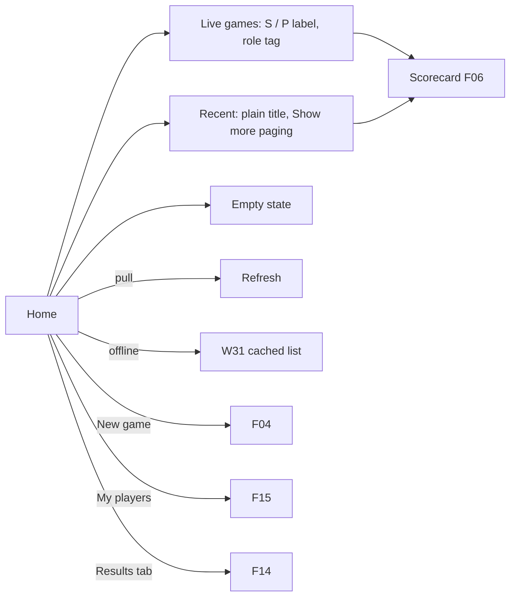
```mermaid
flowchart LR
  H[Home] --> L[Live games: S / P label, role tag]
  H --> R[Recent: plain title, Show more paging]
  H --> E[Empty state]
  H -- pull --> RF[Refresh]
  H -- offline --> C[W31 cached list]
  L --> SC[Scorecard F06]
  R --> SC
  H -- New game --> NG[F04]
  H -- My players --> MP[F15]
  H -- Results tab --> RS[F14]
```

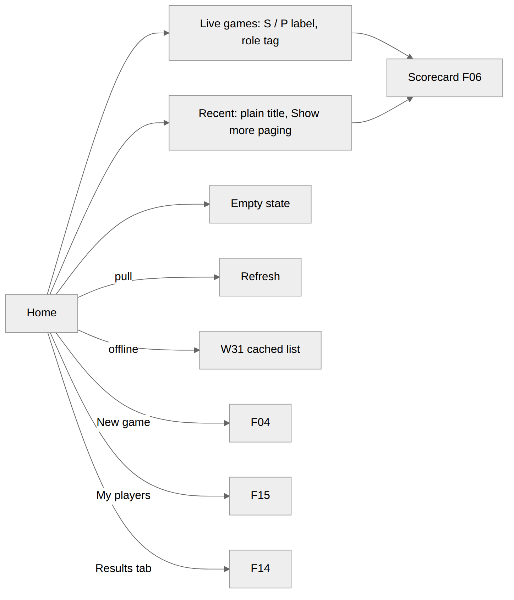

| Who | May | Must not |
| --- | --- | --- |
| CR / AD / PL / SP | see the games they are in | see a game they are not in (OU), including by game number |
| AA | same as a normal user in the app | see everyone's games in the app (admin role is DB-only) |

Warnings: W31. Automated: `smoke/01`, `full/60` (dark), U (degrade). Offline → **N** flow with airplane mode (`full/62-offline.yaml`).

### F04 — New game, Players screen

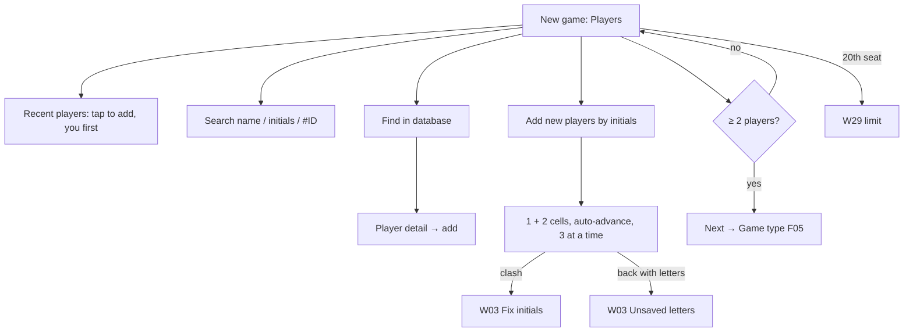
```mermaid
flowchart TD
  A[New game: Players] --> B[Recent players: tap to add, you first]
  A --> C[Search name / initials / #ID]
  A --> D[Find in database] --> D1[Player detail → add]
  A --> E[Add new players by initials] --> E1[1 + 2 cells, auto-advance, 3 at a time]
  E1 -- clash --> E2[W03 Fix initials]
  E1 -- back with letters --> E3[W03 Unsaved letters]
  A --> F{≥ 2 players?}
  F -- no --> A
  F -- yes --> G[Next → Game type F05]
  A -- 20th seat --> H[W29 limit]
```

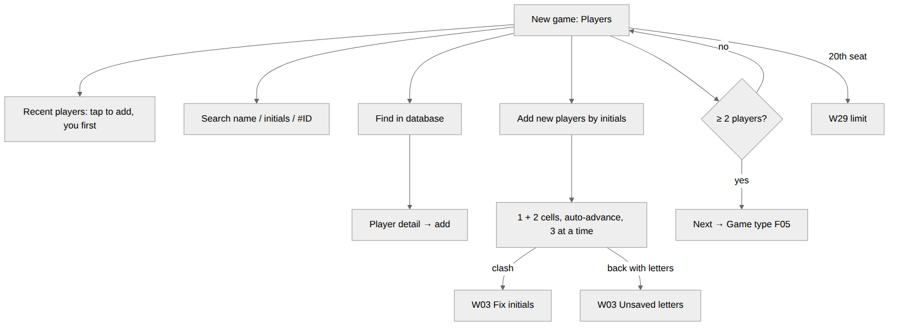

| Who | May | Must not |
| --- | --- | --- |
| any signed-in user (becomes CR) | pick, search, add placeholders | add a 21st player; add the same person twice; add more than 100 new players a day (W29) |

Warnings: W03, W29. Automated: `smoke/09`, U, D (029, 039).

### F05 — New game, Game type screen → Start

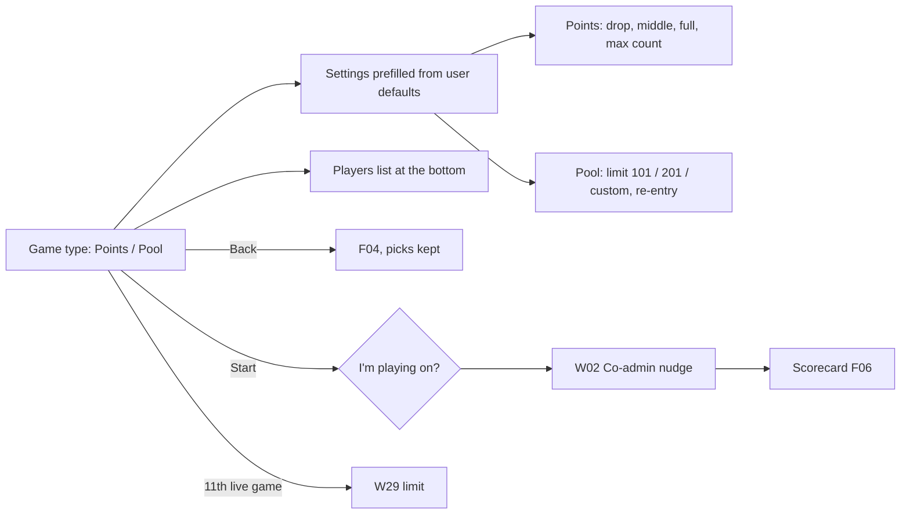
```mermaid
flowchart LR
  A[Game type: Points / Pool] --> B[Settings prefilled from user defaults]
  B --> B1[Points: drop, middle, full, max count]
  B --> B2[Pool: limit 101 / 201 / custom, re-entry]
  A --> C[Players list at the bottom]
  A -- Back --> P[F04, picks kept]
  A -- Start --> D{I'm playing on?}
  D --> E[W02 Co-admin nudge] --> F[Scorecard F06]
  A -- 11th live game --> G[W29 limit]
```

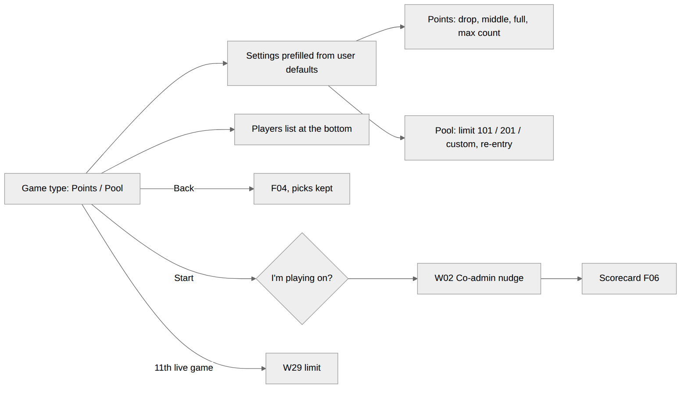

| Who | May | Must not |
| --- | --- | --- |
| CR | choose type, settings, start | change type after round 1 (W34, settings lock); start with one player |

Warnings: W02, W29, W34. Automated: `smoke/09`, `smoke/16` (Pool), U, D (041).

### F06 — Scorecard

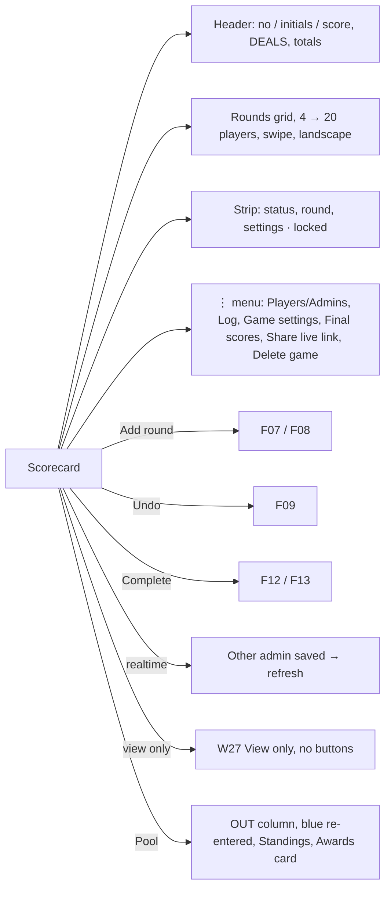
```mermaid
flowchart LR
  A[Scorecard] --> B[Header: no / initials / score, DEALS, totals]
  A --> C[Rounds grid, 4 → 20 players, swipe, landscape]
  A --> D[Strip: status, round, settings · locked]
  A --> E[⋮ menu: Players/Admins, Log, Game settings, Final scores, Share live link, Delete game]
  A -- Add round --> F[F07 / F08]
  A -- Undo --> G[F09]
  A -- Complete --> H[F12 / F13]
  A -- realtime --> I[Other admin saved → refresh]
  A -- view only --> J[W27 View only, no buttons]
  A -- Pool --> K[OUT column, blue re-entered, Standings, Awards card]
```

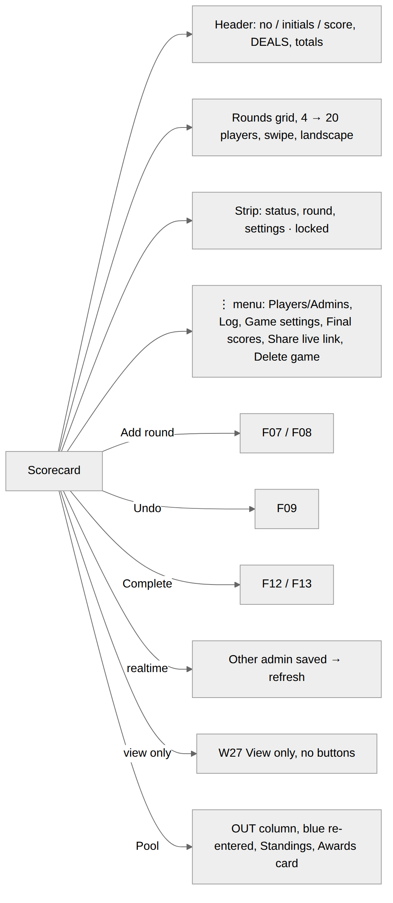

| Who | May | Must not |
| --- | --- | --- |
| CR / AD | everything in the menu, Add round, Undo, Complete | — |
| PL / SP | view, rotate, Share live link, Log | see Add round, Undo, Complete, Delete game, Game settings edit (W27) |
| OU | nothing | open the scorecard by game id or number (RLS) |

Warnings: W27, W11, W12, W13, W14, W15, W34, W35. Automated: `smoke/02`, `03`, `10`, `11`, `16`, `full/20`, `21`, D (RLS), C (realtime).

### F07 — Add round (Points)

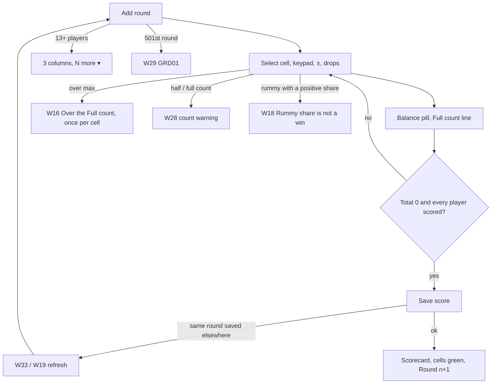
```mermaid
flowchart TD
  A[Add round] --> B[Select cell, keypad, ±, drops]
  B --> C[Balance pill, Full count line]
  B -- over max --> D[W16 Over the Full count, once per cell]
  B -- half / full count --> E[W28 count warning]
  B -- rummy with a positive share --> F[W18 Rummy share is not a win]
  C --> G{Total 0 and every player scored?}
  G -- no --> B
  G -- yes --> H[Save score]
  H -- same round saved elsewhere --> I[W33 / W19 refresh] --> A
  H -- ok --> J[Scorecard, cells green, Round n+1]
  A -- 13+ players --> K[3 columns, N more ▾]
  A -- 501st round --> L[W29 GRD01]
```

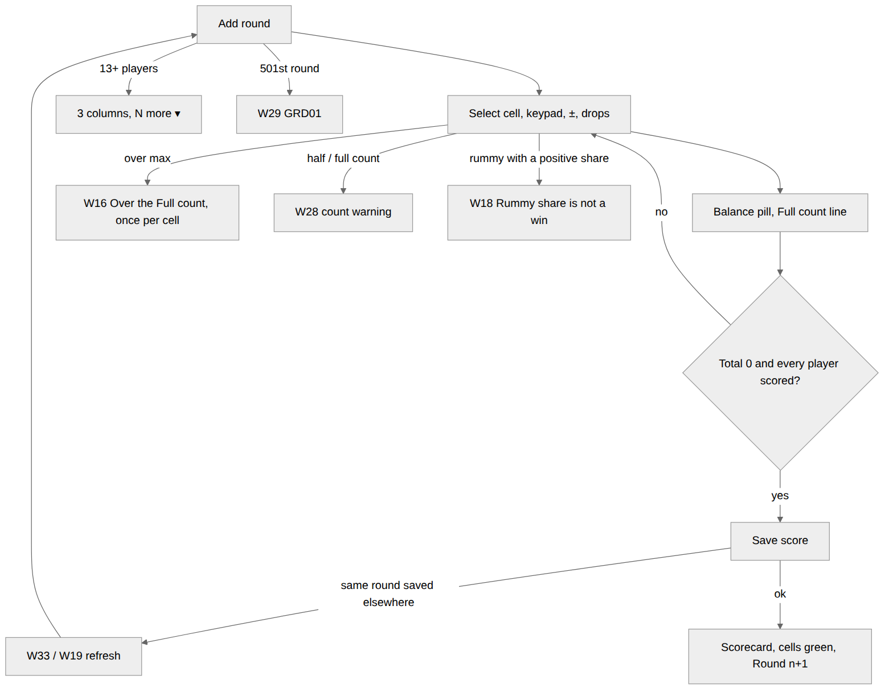

| Who | May | Must not |
| --- | --- | --- |
| CR / AD | enter, save, see the conflict message with the saver's name | save a round whose total is not 0; save twice (double tap) and get two rounds |
| PL / SP / OU | — | reach Add round at all (deep link `score-entry` → W27) |

Warnings: W16, W18, W19, W28, W29, W33. Automated: `smoke/04`, `smoke/14`, `full/80`, U (`add-round-pr3`), D (014, 037), C (concurrency script).

### F08 — Add round (Pool), OUT and re-entry

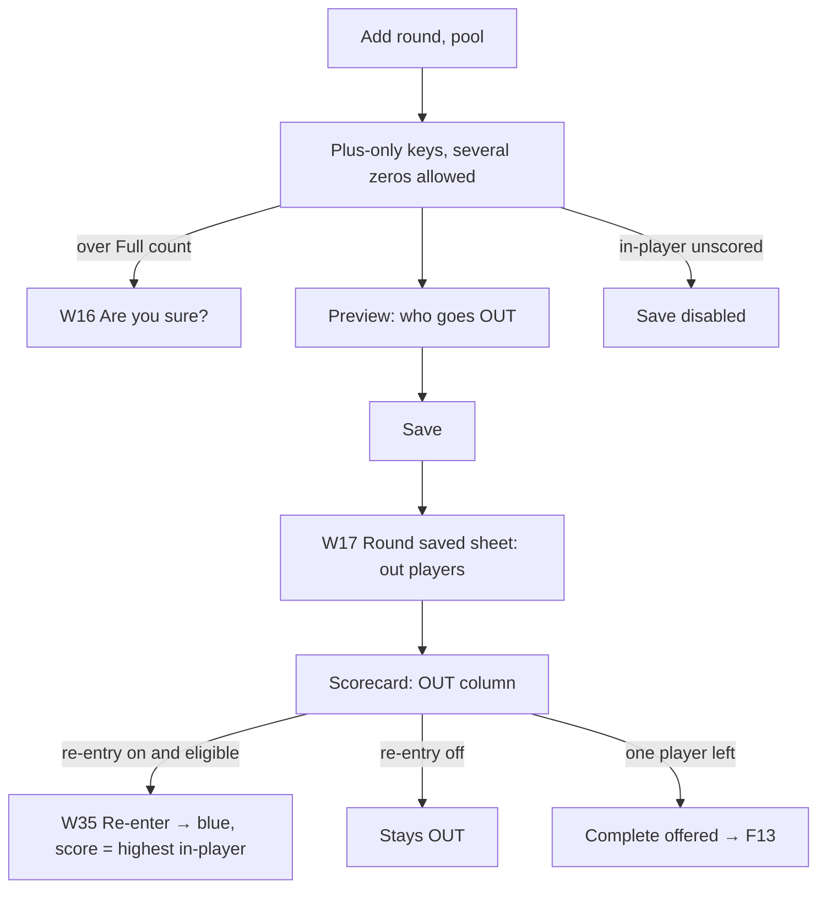
```mermaid
flowchart TD
  A[Add round, pool] --> B[Plus-only keys, several zeros allowed]
  B -- over Full count --> C[W16 Are you sure?]
  B --> D[Preview: who goes OUT]
  D --> E[Save] --> F[W17 Round saved sheet: out players]
  F --> G[Scorecard: OUT column]
  G -- re-entry on and eligible --> H[W35 Re-enter → blue, score = highest in-player]
  G -- re-entry off --> I[Stays OUT]
  G -- one player left --> J[Complete offered → F13]
  B -- in-player unscored --> K[Save disabled]
```

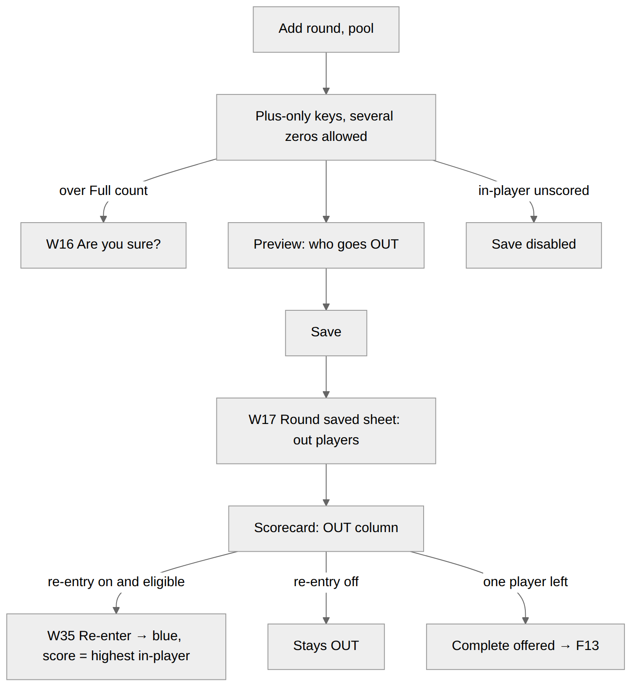

| Who | May | Must not |
| --- | --- | --- |
| CR / AD | save, re-enter an eligible player | enter a negative; re-enter after the eligibility round; re-enter a player who is not OUT; change pool limit after round 1 (W34) |
| PL / SP | watch | re-enter themselves |

Warnings: W16, W17, W34, W35, W27 (Could not re-enter). Automated: `smoke/16`, U (`utils/pool`), D (041).

### F09 — Undo and edit a round

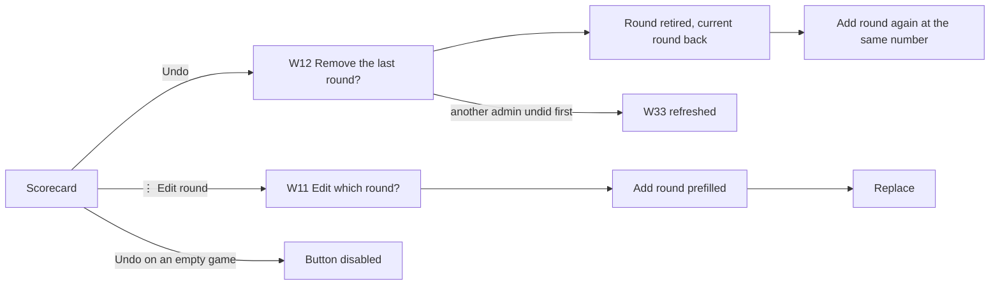
```mermaid
flowchart LR
  A[Scorecard] -- Undo --> B[W12 Remove the last round?] --> C[Round retired, current round back]
  C --> D[Add round again at the same number]
  A -- ⋮ Edit round --> E[W11 Edit which round?] --> F[Add round prefilled] --> G[Replace]
  B -- another admin undid first --> H[W33 refreshed]
  A -- Undo on an empty game --> I[Button disabled]
```

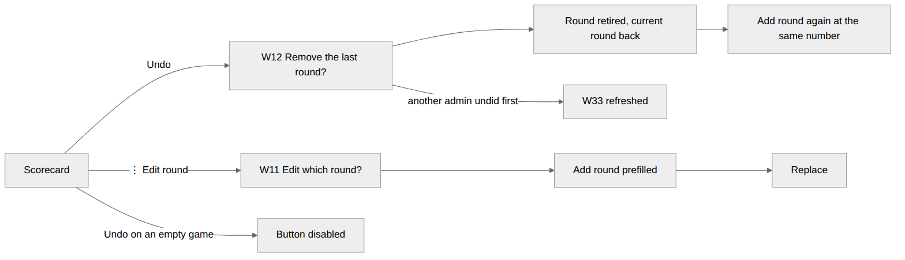

| Who | May | Must not |
| --- | --- | --- |
| CR / AD | undo last, edit any live round | undo a round in a completed game; undo twice from a stale screen and lose two rounds |
| PL / SP | — | see Undo / Edit |

Warnings: W11, W12, W33. Automated: `smoke/13`, D (025 / 035), C case 10.

### F10 — Players / Admins mid-game

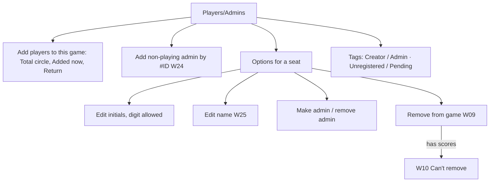
```mermaid
flowchart TD
  A[Players/Admins] --> B[Add players to this game: Total circle, Added now, Return]
  A --> C[Add non-playing admin by #ID W24]
  A --> D[Options for a seat] --> D1[Edit initials, digit allowed]
  D --> D2[Edit name W25]
  D --> D3[Make admin / remove admin]
  D --> D4[Remove from game W09] -- has scores --> D5[W10 Can't remove]
  A --> E[Tags: Creator / Admin · Unregistered / Pending]
```

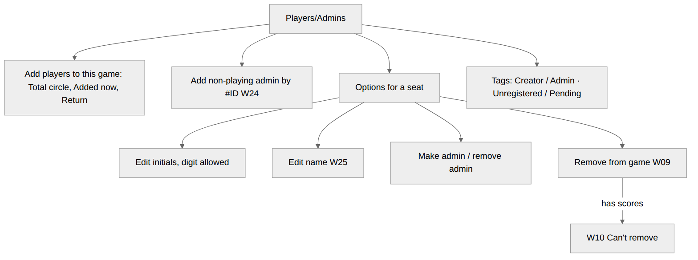

| Who | May | Must not |
| --- | --- | --- |
| CR / AD | add, remove a seat with no scores, edit initials / name of placeholders, promote | remove a seat that has scores (W10); remove the creator; edit a registered player's name |
| PL | open the page, see tags | see Options, Add, promote |

Warnings: W09, W10, W24, W25, W29. Automated: `full/30`, `31`, `32`, D (016, 017, 039).

### F11 — Game log

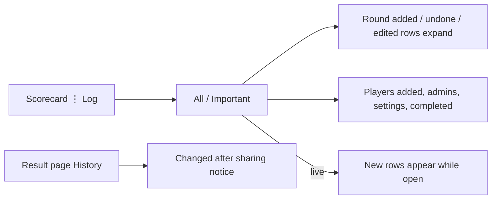
```mermaid
flowchart LR
  A[Scorecard ⋮ Log] --> B[All / Important]
  B --> C[Round added / undone / edited rows expand]
  B --> D[Players added, admins, settings, completed]
  B -- live --> E[New rows appear while open]
  R[Result page History] --> F[Changed after sharing notice]
```

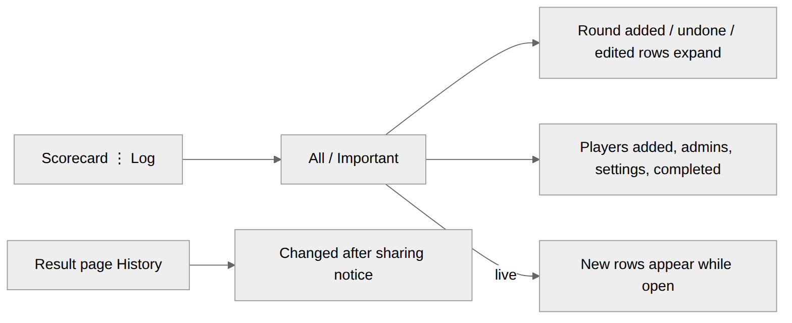

| Who | May | Must not |
| --- | --- | --- |
| CR / AD / PL / SP | read | write (append-only, server side) |
| OU | — | read another game's log |

Warnings: none (W38 on the result side). Automated: `full/70`, D (036), U.

### F12 — Complete (Points) → Final scores → share

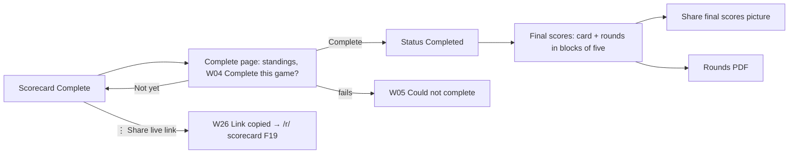
```mermaid
flowchart LR
  A[Scorecard Complete] --> B[Complete page: standings, W04 Complete this game?]
  B -- Not yet --> A
  B -- Complete --> C[Status Completed]
  C --> D[Final scores: card + rounds in blocks of five]
  D --> E[Share final scores picture]
  D --> F[Rounds PDF]
  A -- ⋮ Share live link --> G[W26 Link copied → /r/ scorecard F19]
  B -- fails --> H[W05 Could not complete]
```

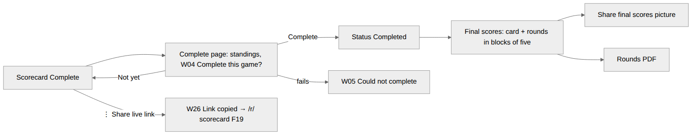

| Who | May | Must not |
| --- | --- | --- |
| CR / AD | complete, share | complete twice; complete a game with an unsaved round open on another phone without a refresh |
| PL / SP | open Final scores of a completed game, share picture / PDF | reach the Complete page |

Warnings: W04, W05, W26. Automated: `smoke/05`, `full/41`, U (image / PDF), D.

### F13 — Complete (Pool) → Awards → Results gating

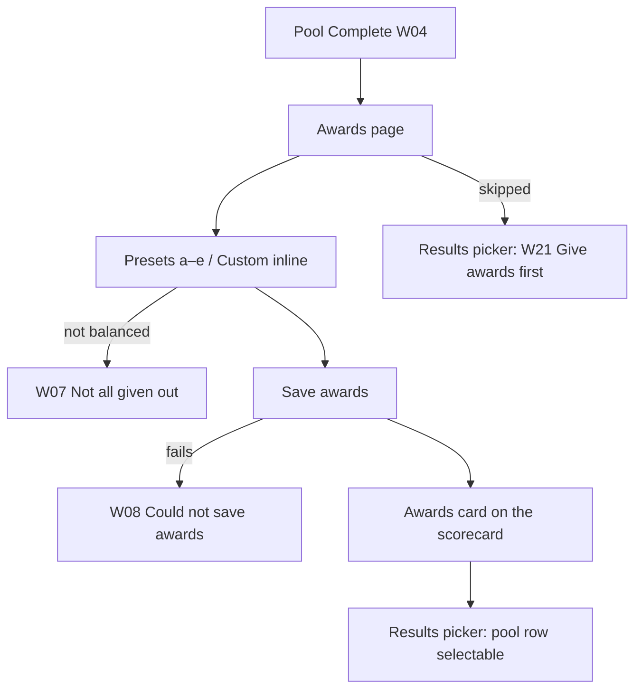
```mermaid
flowchart TD
  A[Pool Complete W04] --> B[Awards page]
  B --> C[Presets a–e / Custom inline]
  C -- not balanced --> D[W07 Not all given out]
  C --> E[Save awards] -- fails --> F[W08 Could not save awards]
  E --> G[Awards card on the scorecard]
  G --> H[Results picker: pool row selectable]
  B -- skipped --> I[Results picker: W21 Give awards first]
```

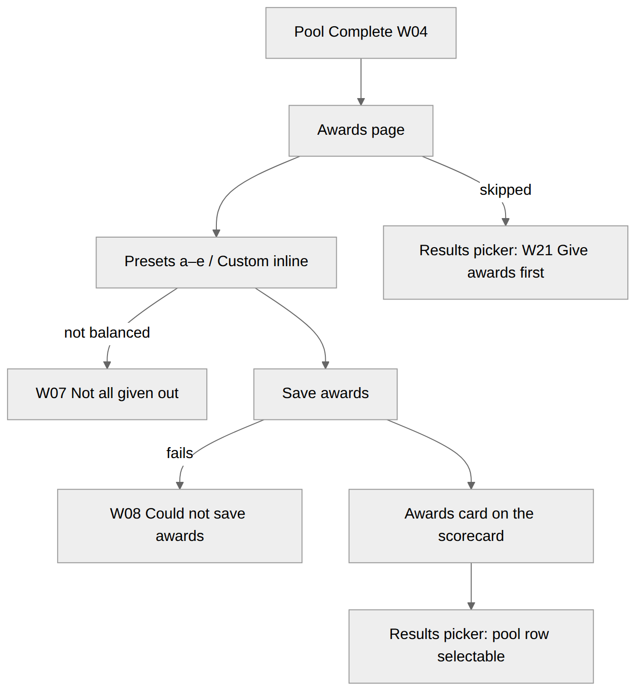

| Who | May | Must not |
| --- | --- | --- |
| CR / AD | give awards once, edit before a result | give awards on an active pool; put a pool in a result before awards (W21) |
| PL / SP | see the Awards card | open the Awards page |

Warnings: W04, W07, W08, W21. Automated: `smoke/16`, U, D (041).

### F14 — Results

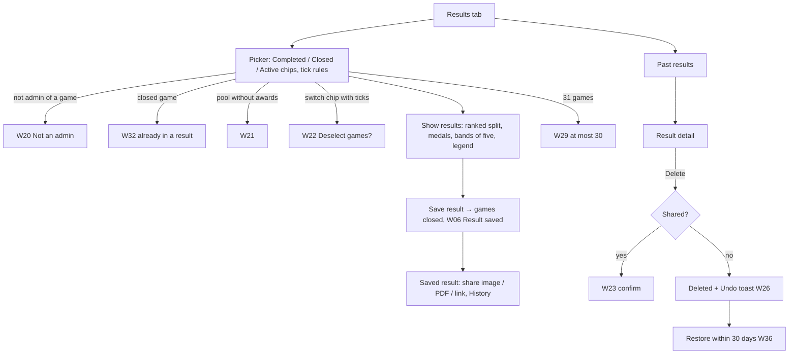
```mermaid
flowchart TD
  A[Results tab] --> B[Picker: Completed / Closed / Active chips, tick rules]
  B -- not admin of a game --> C[W20 Not an admin]
  B -- closed game --> D[W32 already in a result]
  B -- pool without awards --> E[W21]
  B -- switch chip with ticks --> F[W22 Deselect games?]
  B --> G[Show results: ranked split, medals, bands of five, legend]
  G --> H[Save result → games closed, W06 Result saved]
  H --> I[Saved result: share image / PDF / link, History]
  A --> J[Past results] --> K[Result detail]
  K -- Delete --> L{Shared?} -- yes --> M[W23 confirm]
  L -- no --> N[Deleted + Undo toast W26] --> O[Restore within 30 days W36]
  B -- 31 games --> P[W29 at most 30]
```

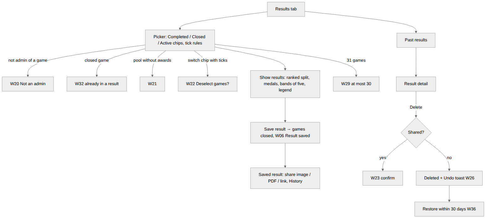

| Who | May | Must not |
| --- | --- | --- |
| CR / AD of every picked game | show, save, share, delete, restore | include a game they do not admin (W20); save with 0 games; delete someone else's result |
| PL | see Past results they are in, open, share | delete |
| SO | `/r/` link only | the picker |

Warnings: W06, W20, W21, W22, W23, W26, W29, W32, W36, W38. Automated: `smoke/06`, `12`, `15`, `full/40`, `41`, U, D (023, 024, 032, 034).

### F15 — My players

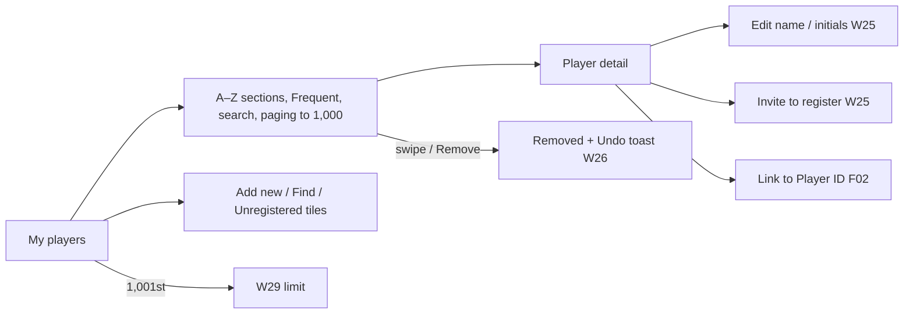
```mermaid
flowchart LR
  A[My players] --> B[A–Z sections, Frequent, search, paging to 1,000]
  A --> C[Add new / Find / Unregistered tiles]
  B --> D[Player detail]
  D --> E[Edit name / initials W25]
  D --> F[Invite to register W25]
  D --> G[Link to Player ID F02]
  B -- swipe / Remove --> H[Removed + Undo toast W26]
  A -- 1,001st --> I[W29 limit]
```

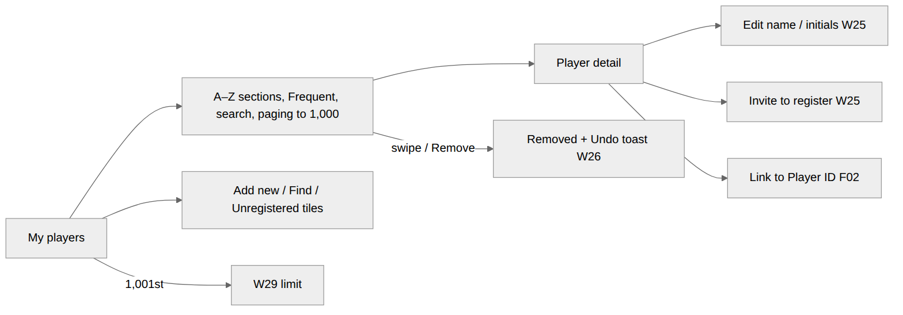

| Who | May | Must not |
| --- | --- | --- |
| any signed-in user | manage their own roster and placeholders | edit a placeholder managed by someone else; remove a registered user from the database (only from the roster) |

Warnings: W25, W26, W29. Automated: `smoke/08`, U, D (027, 030).

### F16 — Me, Profile, Settings

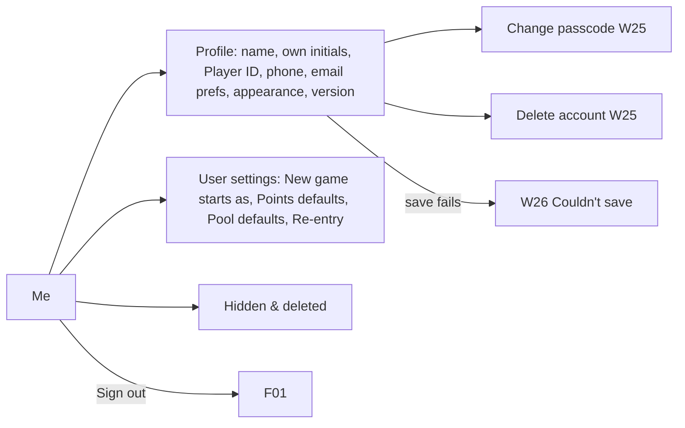
```mermaid
flowchart LR
  A[Me] --> B[Profile: name, own initials, Player ID, phone, email prefs, appearance, version]
  B --> C[Change passcode W25]
  B --> D[Delete account W25]
  A --> E[User settings: New game starts as, Points defaults, Pool defaults, Re-entry]
  A --> F[Hidden & deleted]
  A -- Sign out --> G[F01]
  B -- save fails --> H[W26 Couldn't save]
```

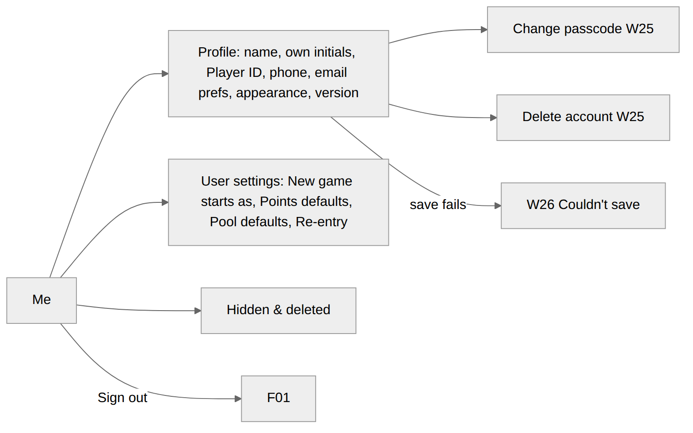

| Who | May | Must not |
| --- | --- | --- |
| any signed-in user | edit their own profile and defaults | change another user's initials; set a pool limit above the cap; delete the account while a live game they created has other players (confirm text) |

Warnings: W25, W26. Automated: `smoke/07`, U, D (026).

### F17 — Help

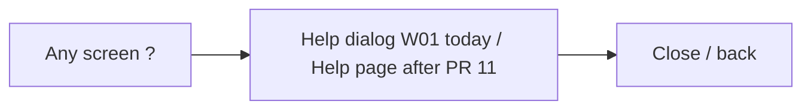
```mermaid
flowchart LR
  A[Any screen ?] --> B[Help dialog W01 today / Help page after PR 11]
  B --> C[Close / back]
```

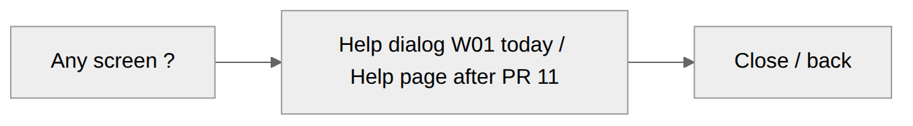

Every role, every screen. Must not: cover the screen's primary button when closed. Warnings: W01. Automated: `full/50`, `smoke/02`, `06`.

### F18 — Delete game, reopen, hidden & deleted

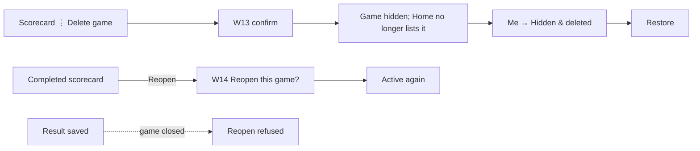
```mermaid
flowchart LR
  A[Scorecard ⋮ Delete game] --> B[W13 confirm] --> C[Game hidden; Home no longer lists it]
  C --> D[Me → Hidden & deleted] --> E[Restore]
  F[Completed scorecard] -- Reopen --> G[W14 Reopen this game?] --> H[Active again]
  I[Result saved] -. game closed .-> J[Reopen refused]
```

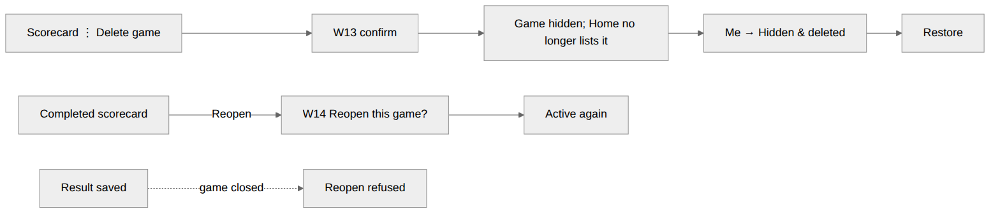

| Who | May | Must not |
| --- | --- | --- |
| CR | delete, restore, reopen | reopen a closed game that is in a result |
| AD | reopen | delete the game |
| PL / SP | — | see either item |

Warnings: W13, W14, W36. Automated: D (016, 023), U; no device flow → **N** (`full/34-delete-reopen.yaml`).

### F19 — Public web pages (signed out)

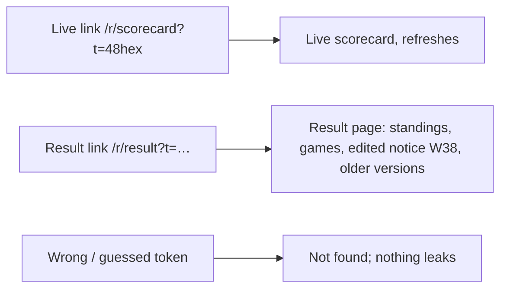
```mermaid
flowchart LR
  A[Live link /r/scorecard?t=48hex] --> B[Live scorecard, refreshes]
  C[Result link /r/result?t=…] --> D[Result page: standings, games, edited notice W38, older versions]
  E[Wrong / guessed token] --> F[Not found; nothing leaks]
```

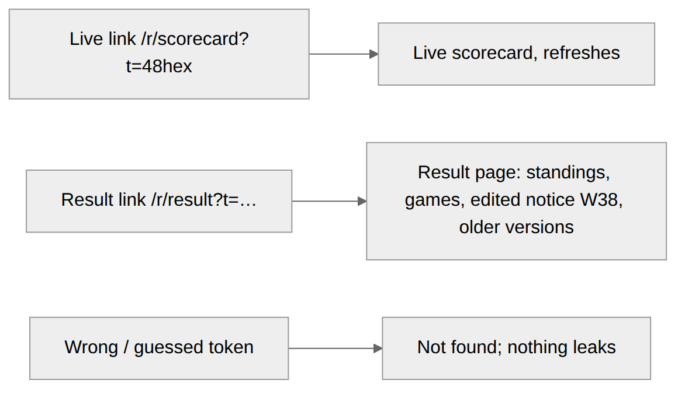

| Who | May | Must not |
| --- | --- | --- |
| SO with the token | view | write anything; enumerate by game id or number; see emails |

Warnings: W38. Automated: D (024, 033 anon revocations), U (page source), volume screenshots; no browser flow → **N** (Playwright on the `/r/` pages, part of PR 16 build).
